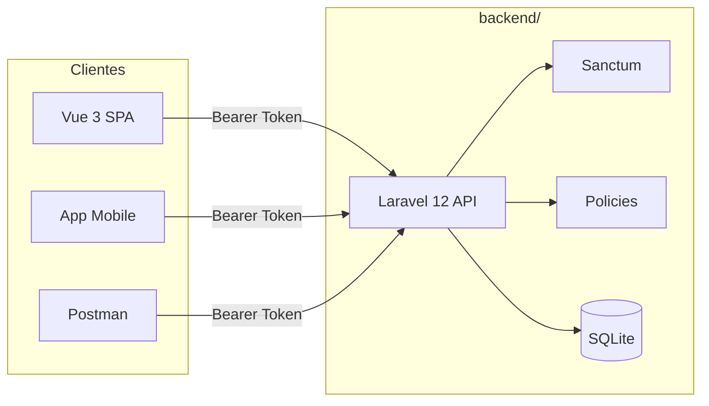

# Arquitetura — Salon Management System

## Visão geral

Sistema de gestão de salão de beleza com **backend e frontend separados**.

```
salon-management-system/
├── backend/          # Laravel 12 API REST (SQLite + Sanctum)
├── frontend/         # Vue 3 + Vite + Tailwind
├── docs/             # Documentação
├── postman/          # Collections Postman
└── legacy-csharp/    # Projeto ASP.NET original (referência)
```

## Princípios

| Princípio | Implementação |
|-----------|---------------|
| API-first | Toda lógica de negócio no Laravel |
| Autenticação | Laravel Sanctum (Bearer token) |
| Autorização | Policies + middleware `role` |
| Validação | Form Requests |
| Respostas | API Resources (JSON padronizado) |
| Banco | SQLite (desenvolvimento e MVP) |
| Documentação API | Postman (sem Swagger) |

## Fluxo de comunicação



## Perfis de utilizador

| Role | Valor | Acesso |
|------|-------|--------|
| Admin | `admin` | Gestão completa, utilizadores, dashboard global |
| Profissional | `professional` | Agenda própria, clientes, serviços (leitura) |
| Cliente | `client` | Perfil, agendamentos próprios, notificações |

## Estrutura do backend

```
backend/
├── app/
│   ├── Enums/UserRole.php
│   ├── Http/
│   │   ├── Controllers/Api/V1/
│   │   ├── Middleware/EnsureUserRole.php
│   │   ├── Requests/Api/V1/
│   │   └── Resources/
│   ├── Models/
│   ├── Policies/
│   └── Services/AppointmentService.php, StockService.php, CashService.php, SaleService.php
├── database/
│   ├── migrations/
│   └── seeders/SalonSeeder.php
└── routes/api.php
```

## Módulos — v1 (implementados)

1. Autenticação (`/api/v1/auth/*`)
2. Utilizadores (`/api/v1/users`) — admin
3. Clientes (`/api/v1/clients`)
4. Profissionais (`/api/v1/professionals`)
5. Serviços (`/api/v1/services`)
6. Agendamentos (`/api/v1/appointments`)
7. Dashboard (`/api/v1/dashboard`)
8. Notificações (`/api/v1/notifications`)
9. Produtos (`/api/v1/products`) — CRUD, barcode, aliases ERP
10. Stock (`/api/v1/stock/*`) — entrada, saída, ajuste, histórico, alertas
11. Vendas (`/api/v1/sales`) — POS com produtos/serviços
12. Caixa (`/api/v1/cash/*`) — abertura, fecho, receitas, despesas, relatório
13. API pública (`/api/v1/public/*`) — catálogo, booking, contacto
14. Mensagens de contacto (`/api/v1/contact-messages`) — admin

## Módulos — próximas etapas

15. Relatórios PDF/Excel
16. Google Calendar
17. WebSockets (Laravel Reverb)

## Segurança

- Passwords com bcrypt (cast `hashed` no model)
- Tokens Sanctum por dispositivo (`device_name`)
- Policies por recurso
- Middleware `role:admin` para rotas administrativas
- Validação de conflito de horários em `AppointmentService`

## Estrutura atual do repositório

```
salon-management-system/
├── backend/          # Laravel 12 API
├── frontend/         # Vue 3 + Vite + Tailwind
├── docs/
└── [C# legado]       # referência de migração
```

## Frontend (Vue 3)

### Stack

- Vue 3 + TypeScript + Vite
- Tailwind CSS v4
- Vue Router (rotas por perfil)
- Pinia (estado de autenticação)
- Axios (cliente HTTP)

### Estrutura

```
frontend/src/
├── components/ui/       # Botões, inputs, cards
├── components/layout/   # AdminShell, ClientShell
├── layouts/             # AdminLayout, ClientLayout
├── views/
│   ├── LoginView.vue
│   ├── admin/           # Dashboard, clientes, serviços, agendamentos
│   └── client/          # Dashboard, meus agendamentos
├── stores/auth.ts
├── services/salonApi.ts
├── router/index.ts
└── lib/api.ts
```

### Painéis

| Rota | Perfil | Funcionalidades |
|------|--------|-----------------|
| `/` | Público | Home do site |
| `/services` | Público | Catálogo de serviços |
| `/products` | Público | Catálogo de produtos |
| `/booking` | Público | Marcação (login para concluir) |
| `/login` | Convidado | Login com token Sanctum |
| `/panel` | admin, professional | Painel principal do sistema |
| `/panel/admin/dashboard` | admin, professional | Dashboard administrativo |
| `/panel/admin/products` | admin, professional | CRUD produtos |
| `/panel/admin/stock` | admin, professional | Movimentos de stock |
| `/panel/admin/sales` | admin, professional | Vendas (POS) |
| `/panel/admin/cash` | admin, professional | Caixa (abrir/fechar, receitas/despesas) |
| `/panel/client/dashboard` | client | Dashboard e notificações |
| `/panel/client/appointments` | client | Listar e cancelar agendamentos |

### Como executar o frontend

```bash
cd frontend
npm install
npm run dev
```

URL: `http://127.0.0.1:5173`

O Vite faz **proxy** de `/api` para `http://127.0.0.1:8000` (sem problemas de CORS em desenvolvimento).

### Executar stack completa

Terminal 1:
```bash
cd backend && php artisan serve
```

Terminal 2:
```bash
cd frontend && npm run dev
```

## Como executar o backend

```bash
cd backend
composer install
cp .env.example .env
php artisan key:generate
touch database/database.sqlite
php artisan migrate:fresh --seed
php artisan serve
```

URL base: `http://127.0.0.1:8000`

## Credenciais de teste (seeder)

| Perfil | Email | Password |
|--------|-------|----------|
| Admin | admin@salon.test | password |
| Profissional | ana.costa@salon.test | password |
| Cliente | maria.silva@salon.test | password |
